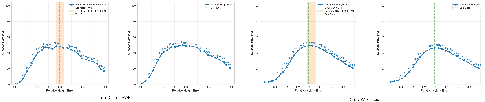

<div align="center">

<h1>Scale-Aware UAV-to-Satellite Cross-View Geo-Localization</h1>

<p>
  A semantic geometric framework for recovering absolute image scale from monocular UAV images
  and improving UAV-to-satellite cross-view geo-localization.
</p>
<p>
  <a href="https://arxiv.org/abs/2603.07535">📄 Paper</a>
</p>

<p>
  If this project helps your research, please consider giving it a ⭐.
</p>
</div>

---

## Introduction

UAV-to-satellite cross-view geo-localization (CVGL) aims to localize a UAV image by matching it with satellite imagery. Existing methods usually work under an implicit assumption: the UAV image and the satellite crop already have similar spatial scale. This setting is common in current benchmarks, where the scale gap between the UAV view and the matched satellite crop is often small. In real applications, however, the absolute scale of the UAV image is often inaccurate or unknown. Once the scale is wrong, the satellite crop can contain too much background or miss useful scene content. This causes field-of-view mismatch and feature mismatch, which directly hurts localization robustness.

<div align="center">
  
  <p><em><small>Fig. 1: Scale comparison in UAV-to-Satellite CVGL: (a) For existing datasets (DenseUAV, GTA-UAV, SUES-200, University-1652), UAV image scales are consistent with satellite images (normalized to 1.0), with maximum difference not exceeding a factor of 2; (b) Under unknown scale, imprecise satellite cropping causes huge scale/FOV discrepancies between UAV images and satellite crops.</small></em></p>
</div>

To address this problem, we propose a scale-aware CVGL framework that first estimates the physical scale of a monocular UAV image and then uses this scale to guide satellite cropping. Instead of relying on multi-view geometry or extra range sensors, our method uses **small vehicles as semantic anchors**. Small vehicles are common in urban UAV images, easy to detect, and have relatively stable real-world size. Based on detected vehicles and camera geometry, we build a semantic geometric model to recover image scale from a single frame. The estimated scale is then used for scale-adaptive satellite cropping, which reduces the mismatch between UAV queries and satellite galleries before cross-view retrieval.

This design makes the localization pipeline more physically grounded under unknown-altitude conditions. It also supports related tasks such as UAV altitude initialization and metric scale recovery for orthophotos.

---

## Method at a glance

<div align="center">
  
  <p><em><small>Fig. 2: Overview of the proposed scale-aware CVGL framework. The method first uses oriented bounding boxes of small vehicles as semantic anchors. A decoupled stereoscopic projection model and statistical dimension priors estimate single-instance absolute scale, then robust global scale estimation guides scale-adaptive cropping of satellite imagery for robust CVGL.</small></em></p>
</div>

The pipeline contains two stages. In the first stage, small vehicles are detected in the UAV image. Each detected vehicle provides a scale cue through vehicle size priors and camera geometry, and multiple cues are fused into a robust global scale estimate. In the second stage, the estimated scale is used to determine the physical size of the satellite crop. This improves the alignment between the UAV image and the satellite image, reduces field-of-view mismatch, and makes cross-view matching more reliable.

---

## Experiments and Results

### Datasets

To evaluate scale-aware localization, we build two refined benchmarks, **DenseUAV+** and **UAV-VisLoc+**, from the original DenseUAV and UAV-VisLoc datasets.

**DenseUAV+** extends DenseUAV with **spatially continuous satellite maps**, so the satellite gallery can support scale-adaptive cropping at different altitudes. We use the official training set to train the CVGL model and the official test subset with **2,331** UAV images for evaluation. The relative altitude range is **80--100 m**.

**UAV-VisLoc+** is built from UAV-VisLoc through **SfM-based pose refinement and data cleaning**. We refine camera poses, build ortho-map and DSM products, and compute reliable relative altitude for each frame. After removing problematic regions and low-texture water-dominated images, the final testbed contains **4,638** UAV images with relative altitude range **325--595 m**.

These two datasets let us evaluate the relation between image scale, altitude estimation, and localization performance in realistic UAV scenarios.

| Dataset | Source | Key refinement | Test images | Relative altitude |
|---|---|---|---:|---:|
| DenseUAV+ | DenseUAV | Continuous satellite maps for arbitrary cropping | 2,331 | 80--100 m |
| UAV-VisLoc+ | UAV-VisLoc | SfM refinement, DSM-based relative altitude, data cleaning | 4,638 | 325--595 m |

---

### Main results: Sensitivity to scale mismatch

<div align="center">
  
  <p><em><small>Fig. 5: Sensitivity to scale mismatch. Success Rate (SR, %) under different relative altitude ratios δ in Ĥ = H(1 + δ) (equivalently, relative scale mismatch). Left: queries where the scale estimator is applicable; right: all queries. The green line indicates δ = 0. The orange band visualizes the distribution (μ ± σ) of estimated scale errors, showing most estimates fall into the stable regime where CVGL is less sensitive to scale.</small></em></p>
</div>

We first study how scale mismatch affects cross-view geo-localization. For each UAV query, we change the satellite crop scale around the ground-truth value and evaluate the localization success rate. The results show a clear trend: **performance is best when the crop scale is close to the ground truth**, and it drops steadily as the relative scale error becomes larger. This confirms that scale mismatch is a major source of failure in UAV-to-satellite CVGL.

The orange error band in the figure shows the distribution of our estimated scale errors. Most predictions fall near the stable region around the correct scale, which explains why the proposed scale-aware pipeline can keep localization performance close to the ideal ground-truth setting.

---

### Qualitative results: Visualization of scale mismatch in scale-adaptive CVGL

<div align="center">
  
  <p><em><small>Fig. 6: Visualization of scale mismatch in scale-adaptive CVGL. We use one UAV-VisLoc+ query and vary the relative altitude ratio δ in Ĥ = H(1 + δ). Top: local GT view with UAV query and GT satellite crops under different δ. Middle: global search view with the satellite search region and similarity heatmaps. Bottom: retrieved satellite patches and localization outcomes (green/red), with detected vehicles shown as anchors. When δ = 0, the similarity surface has a clear dominant peak near GT; under mismatch, it becomes multi-modal; our estimated scale recovers reliable localization.</small></em></p>
</div>

This figure shows how scale mismatch changes the similarity landscape during retrieval. When the scale is matched (δ = 0), the similarity surface has a clear dominant peak near the ground-truth location. Under mismatch (for example, δ = ±0.25 or ±0.50), the similarity surface becomes multi-modal and the predicted location may drift to spurious peaks. With our estimated scale (Est), the crop is pulled back to a near-correct regime and localization becomes stable again.

---

### Qualitative comparison with monocular depth estimation

<div align="center">
  
  <p><em><small>Fig. 7: Qualitative comparison with monocular depth estimation. Rows (a)–(b): UAV-VisLoc; rows (c)–(d): DenseUAV. Each row shows (left to right) the UAV image, vehicle detections, Depth Anything V3 relative depth/3D visualization, and the estimated ground distance. GT: ground truth; MDE: Depth Anything V3; Ours: our method.</small></em></p>
</div>

We compare our scale recovery with a recent monocular depth estimation (MDE) model, [Depth Anything 3](https://depth-anything-3.github.io). Although the relative depth maps can look plausible, the model often fails to provide reliable metric scale on UAV imagery, which leads to severely underestimated distances. In contrast, our method uses explicit geometric constraints together with vehicle size priors and platform-available calibration/pose information, so it produces stable scale estimates and is easier to deploy in practice.

---

### Scale estimation accuracy

We further evaluate the accuracy of the proposed scale estimation method. Since the satellite crop size is proportional to UAV altitude under fixed camera intrinsics, the relative altitude error is equivalent to the relative scale error. We therefore report the Mean Absolute Percentage Error (MAPE) as the main metric.

| Dataset | Images used | Used ratio | Mean error (MAPE) |
|---|---:|---:|---:|
| DenseUAV+ | 786 / 2,331 | 33.7% | **2.9%** |
| UAV-VisLoc+ | 2,340 / 4,638 | 50.5% | **4.4%** |

The results show that our method can recover image scale with high accuracy on both benchmarks. DenseUAV+ gives slightly better accuracy because vehicles appear larger at lower flight altitude, which reduces the effect of detector noise and pixel quantization. On UAV-VisLoc+, although the altitude range is much larger and some regions contain fewer vehicles, the overall error remains low. These results indicate that the estimated scale is accurate enough for robust scale-adaptive CVGL.

When the estimated scale is used for satellite cropping, the localization success rate stays close to the ground-truth-scale setting: **48.0% vs. 48.3%** on DenseUAV+, and **53.1% vs. 54.4%** on UAV-VisLoc+. This is consistent with the sensitivity analysis above.

---

## To do List

- [x] Release monocular scale estimation code
- [x] Release the DenseUAV+ Dataset
- [x] Release scale-adaptive CVGL pipeline
- [ ] Release object detection code for small vehicles
- [ ] Release the UAVVisLoc+ Dataset

---

## Repository structure

```bash
.
├── asserts/                               # Figures used in README
├── CVGL/                                  # Scale-adaptive CVGL Code
├── Scale_Est/                             # Scale Estimation Code
└── README.md
```

## Data download

Please download the required files separately for the two parts of this repository.

#### 1. Scale estimation data (`Scale_Est/`)

This package contains the prepared dataset files and detection results required by the monocular scale estimation code.

- **Baidu NetDisk**: https://pan.baidu.com/s/1X9sHwjkD7-WcoUXLUaZGVw?pwd=4qye

#### 2. CVGL data and model files (`CVGL/`)

This package contains the retrieval resources, such as satellite maps, YAML files, reference files, and pre-trained model weights.

- **Baidu NetDisk**: https://pan.baidu.com/s/1OjLWyUSm4MkxaFuZ_w96Zg?pwd=fz7i

The two download packages are different and should not be confused.

## Released scale estimation code

The released monocular scale estimation code is in the `Scale_Est/` folder.

The current release assumes that **small-vehicle detection results are already available**. In other words, this repository does **not** yet include the detector training or inference code.

You only need to prepare:

- UAV images
- metadata required by each dataset
- detection results of small vehicles

The main files are:

- **`Scale_Est/config.py`**: define dataset paths, detection-result paths, and scale-estimation hyper-parameters.
- **`Scale_Est/dataset_adapters.py`**: convert different datasets into a unified metadata format used by the estimator.
- **`Scale_Est/scale_estimator.py`**: implement the semantic geometric scale estimation algorithm.
- **`Scale_Est/demo.py`**: provide a simple entry point to run evaluation on DenseUAV+ or UAV-VisLoc+.

### How to use the scale estimation code

#### 1. Modify dataset paths and detection-result paths

Before running the code, first edit the paths in `Scale_Est/config.py`.

For **UAV-VisLoc+**, the main fields are:

```python
UAV_VISLOC_CONFIG = {
    'root_dir': '/path/to/UAVVisLoc_plus',
    'detection_root': '/path/to/detection/results',
}
```

For **DenseUAV+**, the main fields are:

```python
DENSE_UAV_CONFIG = {
    'image_dir': '/path/to/DenseUAV/images',
    'detection_file': '/path/to/small-vehicle.txt',
}
```

The released code assumes that the detection results have already been generated and saved as text files.

#### 2. Modify scale-estimation parameters if needed

You can adjust several important parameters in `COMMON_CONFIG` in `Scale_Est/config.py`, for example:

- `confidence_threshold`: minimum confidence for keeping vehicle detections
- `min_vehicles_threshold`: minimum number of valid vehicles required for one image
- `average_car_width`, `average_car_height`, `average_car_length`: vehicle size priors

#### 3. Check dataset-specific metadata preparation

`Scale_Est/dataset_adapters.py` handles dataset-specific metadata:

- **UAV-VisLoc+**: reads `reference.txt`, `camera.xml`, and DSM files to compute relative altitude.
- **DenseUAV+**: reads the relative altitude directly from the image filename and uses fixed camera intrinsics.

If you want to adapt the code to your own dataset, the easiest way is to follow the adapter interface and add a new dataset adapter.

#### 4. Run the released evaluation code

From the repository root:

```bash
cd Scale_Est
python demo.py
```

---

## Scale-adaptive CVGL using estimated scale (DenseUAV guide)

This section explains how to use the estimated altitude to crop the satellite image at the correct scale, extract features, and match them against the UAV query. 

The guide covers three scripts:

- **`CVGL/DU__precompute.py`** – pre-compute satellite feature galleries for a range of altitudes and store them in an HDF5 file.
- **`CVGL/DU__est_only.py`** – end-to-end retrieval using estimated altitudes from a CSV file and **on-the-fly** satellite cropping.
- **`CVGL/DU__eval_scale_uncertainty.py`** – evaluate retrieval performance under different altitude errors using a pre-computed feature gallery.

All examples below are based on DenseUAV.

### Data and model preparation

The CVGL package includes three main components:

1. **DenseUAV+ Dataset resources** such as satellite images, YAML files, UAV images, and GPS ground truth
2. **Pre-trained model weights** for the feature extractor (CAMP trained on DenseUAV)
3. **Reference files** such as the estimated height CSV used by the retrieval scripts

**Download from Baidu NetDisk:** https://pan.baidu.com/s/1OjLWyUSm4MkxaFuZ_w96Zg?pwd=fz7i

Install dependencies from the repository root with:

```bash
cd CVGL
pip install -r requirements.txt
```

The CVGL scripts import modules from `CVGL/multi_model/`. The simplest way to avoid import issues is to run the scripts inside the `CVGL/` directory, as shown below.

### Step 1: Satellite image metadata (YAML)

Each satellite map is accompanied by a YAML file containing its UTM origin, resolution, and path. Example: `DenseUAV_2018_1_1_L20.yaml`

```yaml
REF_path: /path/to/DenseUAV_2018_1_1_L20.tif
UTM_SYSTEM: 50N
REF_initialX: 820169.5021495082
REF_initialY: 3360120.396102462
resolution: 0.26331604640774253
```

Edit the paths in the YAML to point to your local satellite image.

### Step 2: Pre-compute satellite feature gallery (optional but recommended)

Pre-computing features for a range of altitudes allows fast experimentation and evaluation of scale sensitivity.

Script: `CVGL/DU__precompute.py`

1. Edit the configuration at the bottom of the script:

```python
opt.save_base_path = "RESULTS"
opt.subfolder_name = "DU_h5_example"
opt.run_tag = "DU_features"
opt.UAV_size = [384, 384]          # input size of the network
opt.step_cover = 50                # sliding window overlap (50% = step = 192 px)
opt.batch_size = 32
opt.num_workers = 4
opt.relative_error = 0.8           # altitude range relative to nominal heights
opt.device = 'cuda:0'
opt.ck_path = '/path/to/weights.pth'
yaml_path = '/path/to/DenseUAV_2018_1_1_L20.yaml'
```

2. Run the script:

```bash
cd CVGL
python DU__precompute.py
```

It will:

- read the satellite image and YAML;
- for each altitude in the range derived from the dataset (for example, 40–150 m with 5 m step), resize the satellite image so that the network input size (384×384) corresponds to the physical field of view at that altitude;
- extract features from all sliding-window patches using the pre-trained model;
- save features and their UTM coordinates in an HDF5 file such as `RESULTS/DU_h5_example/DU_features.h5`.

The HDF5 file contains groups named `height_XX` with datasets `features` and `centers_utm`, plus attributes `fov_size_meters` and `scale_factor`.

### Step 3a: End-to-end retrieval with estimated altitudes

This script demonstrates the full pipeline:

- load a UAV image;
- obtain its estimated altitude from a CSV file produced by the scale estimator;
- use that altitude to dynamically crop the satellite image at the correct scale;
- extract the UAV query feature and match it against all satellite patches to find the best match.

Script: `CVGL/DU__est_only.py`

1. Edit the configuration at the top of the script:

```python
CONFIG = {
    'device': 'cuda:0',
    'image_dir': '/path/to/DenseUAV/all_JPGs/',        # UAV images
    'gt_txt_path': '/path/to/Dense_GPS_ALL.txt',       # ground truth GPS
    'est_height_csv': 'reference/DenseUAV_conf0.5/summary.csv',
    'yaml_path': 'tif_yamls/DenseUAV_2018_1_1_L20.yaml',
    'ckpt_path': '/path/to/weights.pth',
    'net_input_size': 384,
    'step_overlap': 0.5,
    'batch_size': 16,
    'CLAHE': False,
    'save_base_path': "RESULTS",
    'subfolder_name': "DenseUAV_Est_Only",
    'run_tag': "DU_retrieval_example"
}
```

`est_height_csv` should contain columns `Image_ID` and `Estimated_Height(m)`. The script will automatically skip images without an estimated height. You can use the provided reference file in `CVGL/reference/`, or generate your own CSV with the scale estimation code in `Scale_Est/`.

2. Run the script:

```bash
cd CVGL
python DU__est_only.py
```

For each UAV image with a valid estimated height, it:

- computes the required satellite ground sampling distance (GSD) from the altitude;
- resizes the satellite map accordingly;
- generates all 384×384 patches with a sliding window;
- extracts the UAV feature and computes cosine similarity;
- picks the patch with the highest similarity, converts its center to UTM, and compares it with ground truth;
- saves results in `RESULTS/DenseUAV_Est_Only/<timestamp>_DU_retrieval_example/` as CSV files.

3. Output interpretation:

- `est_only_overall_detailed.csv` – per-image details, including real height, estimated height, relative height error, position error in meters, and success.
- `est_only_overall_summary.csv` – aggregated mean and median error, and success rate.

### Step 3b: Scale sensitivity analysis with pre-computed features

This script evaluates how retrieval performance changes when the satellite crop scale deviates from the true altitude. It uses the HDF5 feature gallery created in Step 2.

Script: `CVGL/DU__eval_scale_uncertainty.py`

1. Edit the configuration:

```python
CONFIG = {
    'device': 'cuda:0',
    'image_dir': '/path/to/DenseUAV/all_JPGs/',
    'gt_txt_path': '/path/to/Dense_GPS_ALL.txt',
    'hdf5_path': 'RESULTS/DU_h5_example/DU_features.h5',
    'ck_path': '/path/to/weights.pth',
    'uav_input_size': 384,
    'batch_size': 32,
    'save_base_path': "RESULTS",
    'subfolder_name': "Scale_Uncertainty_Exp",
    'run_tag': "DU_sensitivity",
    'error_range': 0.8
}
```

2. Run the script:

```bash
cd CVGL
python DU__eval_scale_uncertainty.py
```

It will:

- group UAV images by their true altitude;
- loop over all available test altitudes within the `error_range`;
- load the corresponding pre-computed features from the HDF5;
- compute similarity and record the result;
- write detailed CSV files per altitude group and an overall summary.

3. Output:

- `scale_overall_detailed.csv` contains rows for every `(image, test_height)` pair.
- `scale_overall_summary.csv` aggregates the results by relative height error bins, showing how success rate and position error vary with scale mismatch.

### Important notes

- **Model weights** must be downloaded separately. The scripts expect the checkpoint path to point to a `.pth` file compatible with `get_camp_model`.
- **UTM zone** is automatically parsed from the YAML (`UTM_SYSTEM` field). If your data lies in a different zone, update the YAML accordingly.
- **Satellite image resolution** (`resolution` in YAML) is used to convert pixel coordinates to UTM. Ensure it matches the actual GSD of your satellite tile.
- The scripts assume the UAV camera intrinsics and mounting are fixed as in DenseUAV. If you adapt them to another dataset, modify the camera parameters inside the scripts, such as `cam_size`, `focal_len`, image dimensions, and pitch.

---
## Citation

If you find this project useful, please cite:

```bibtex
@misc{ye2026scale,
      title={Scale-Aware UAV-to-Satellite Cross-View Geo-Localization: A Semantic Geometric Approach},
      author={Yibin Ye and Shuo Chen and Kun Wang and Xiaokai Song and Jisheng Dang and Qifeng Yu and Xichao Teng and Zhang Li},
      year={2026},
      eprint={2603.07535},
      archivePrefix={arXiv},
      primaryClass={cs.CV},
      url={https://arxiv.org/abs/2603.07535},
}
```

---

## Acknowledgement

We sincerely thank the authors of the public datasets and prior methods that support this project.

Our experiments build upon or are related to the following public resources:

- [DenseUAV](https://github.com/Dmmm1997/DenseUAV)
- [UAV-VisLoc](https://github.com/IntelliSensing/UAV-VisLoc)
- [DOTA](https://captain-whu.github.io/DOTA/dataset.html)
- [CAMP](https://github.com/Mabel0403/CAMP)
- [VSAI](https://datasetninja.com/vsai)
